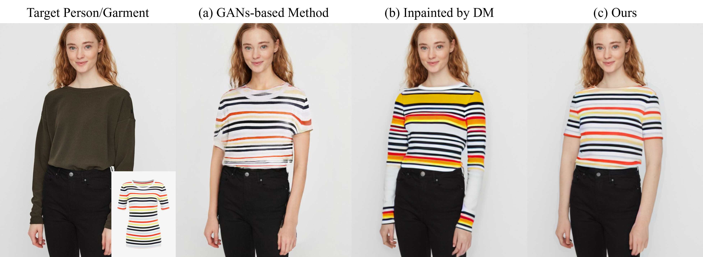

# DCI-VTON-Virtual-Try-On
This is the official repository for the following paper:
> **Taming the Power of Diffusion Models for High-Quality Virtual Try-On with Appearance Flow** [[arxiv]](https://arxiv.org/pdf/2308.06101.pdf)
>
> Junhong Gou, Siyu Sun, Jianfu Zhang, Jianlou Si, Chen Qian, Liqing Zhang  
> Accepted by **ACM MM 2023**.

## News
- *2023-12-06* We have updated the selection strategy of inpainting mask similar to VITON-HD and HR-VTON in `cp_dataset_v2.py`. The pretrained model based 
on this new masking strategy is available from [Google Drive](https://drive.google.com/drive/folders/11BJo59iXVu2_NknKMbN0jKtFV06HTn5K?usp=sharing).


## Overview

> **Abstract:**  
> Virtual try-on is a critical image synthesis task that aims to transfer clothes from one image to another while preserving the details of both humans and clothes.
> While many existing methods rely on Generative Adversarial Networks (GANs) to achieve this, flaws can still occur, particularly at high resolutions.
> Recently, the diffusion model has emerged as a promising alternative for generating high-quality images in various applications.
> However, simply using clothes as a condition for guiding the diffusion model to inpaint is insufficient to maintain the details of the clothes.
To overcome this challenge, we propose an exemplar-based inpainting approach that leverages a warping module to guide the diffusion model's generation effectively.
> The warping module performs initial processing on the clothes, which helps to preserve the local details of the clothes.
> We then combine the warped clothes with clothes-agnostic person image and add noise as the input of diffusion model.
> Additionally, the warped clothes is used as local conditions for each denoising process to ensure that the resulting output retains as much detail as possible.
> Our approach effectively utilizes the power of the diffusion model, and the incorporation of the warping module helps to produce high-quality and realistic virtual try-on results.
> Experimental results on VITON-HD demonstrate the effectiveness and superiority of our method.
## Getting Started
### Installation
#### Diffusion Model
1. Clone the repository
```shell
git clone https://github.com/bcmi/DCI-VTON-Virtual-Try-On.git
cd DCI-VTON-Virtual-Try-On
```
2. Install Python dependencies
```shell
conda env create -f environment.yaml
conda activate dci-vton
```
3. Download the pretrained [vgg](https://drive.google.com/file/d/1rvow8jStPt8t2prDcSRlnf8yzXhrYeGo/view?usp=sharing) checkpoint and put it in `models/vgg/`
#### Warping Module
4. Clone the PF-AFN repository
```shell
git clone https://github.com/geyuying/PF-AFN.git
```
5. Move the code to the corresponding directory
```shell
cp -r DCI-VTON-Virtual-Try-On/warp/train/* PF-AFN/PF-AFN_train/
cp -r DCI-VTON-Virtual-Try-On/warp/test/* PF-AFN/PF-AFN_test/
```
### Data Preparation
#### VITON-HD
1. Download [VITON-HD](https://github.com/shadow2496/VITON-HD) dataset
2. Download pre-warped cloth image/mask from [Google Drive](https://drive.google.com/drive/folders/15cBiA0AoSCLSkg3ueNFWSw4IU3TdfXbO?usp=sharing) or [Baidu Cloud](https://pan.baidu.com/s/1ss8e_Fp3ZHd6Cn2JjIy-YQ?pwd=x2k9) and put it under your VITON-HD dataset

After these, the folder structure should look like this (the unpaired-cloth* only included in test directory):
```
├── VITON-HD
|   ├── test_pairs.txt
|   ├── train_pairs.txt
│   ├── [train | test]
|   |   ├── image
│   │   │   ├── [000006_00.jpg | 000008_00.jpg | ...]
│   │   ├── cloth
│   │   │   ├── [000006_00.jpg | 000008_00.jpg | ...]
│   │   ├── cloth-mask
│   │   │   ├── [000006_00.jpg | 000008_00.jpg | ...]
│   │   ├── cloth-warp
│   │   │   ├── [000006_00.jpg | 000008_00.jpg | ...]
│   │   ├── cloth-warp-mask
│   │   │   ├── [000006_00.jpg | 000008_00.jpg | ...]
│   │   ├── unpaired-cloth-warp
│   │   │   ├── [000006_00.jpg | 000008_00.jpg | ...]
│   │   ├── unpaired-cloth-warp-mask
│   │   │   ├── [000006_00.jpg | 000008_00.jpg | ...]
```
### Inference
#### VITON-HD
Please download the pretrained model from [Google Drive](https://drive.google.com/drive/folders/11BJo59iXVu2_NknKMbN0jKtFV06HTn5K?usp=sharing) or [Baidu Cloud](https://pan.baidu.com/s/13Rp_-Fbp1NUN41q0U6S4gw?pwd=6bfg).
###### Warping Module
To test the warping module, first move the `warp_viton.pth` to `checkpoints` directory:
```shell
mv warp_viton.pth PF-AFN/PF-AFN_test/checkpoints
```
Then run the following command:
```shell
cd PF-AFN/PF-AFN_test
sh test_VITON.sh
```
After inference, you can put the results in the VITON-HD for inference and training of the diffusion model. 
###### Diffusion Model
To quickly test our diffusion model, run the following command:
```shell
python test.py --plms --gpu_id 0 \
--ddim_steps 100 \
--outdir results/viton \
--config configs/viton512.yaml \
--ckpt /CHECKPOINT_PATH/viton512.ckpt \
--dataroot /DATASET_PATH/ \
--n_samples 8 \
--seed 23 \
--scale 1 \
--H 512 \
--W 512 \
--unpaired
```
or just simply run:
```shell
sh test.sh
```
### Training
#### Warping Module
To train the warping module, just run following commands:
```shell
cd PF-AFN/PF-AFN_train/
sh train_VITON.sh
```
#### Diffusion Model
We utilize the pretrained Paint-by-Example as initialization, please download the pretrained models from [Google Drive](https://drive.google.com/file/d/15QzaTWsvZonJcXsNv-ilMRCYaQLhzR_i/view) and save the model to directory `checkpoints`. 

To train a new model on VITON-HD, you should first modify the dataroot of VITON-HD dataset in `configs/viton512.yaml` and then use `main.py` for training. For example,
```shell
python -u main.py \
--logdir models/dci-vton \
--pretrained_model checkpoints/model.ckpt \
--base configs/viton512.yaml \
--scale_lr False
```
or simply run:
```shell
sh train.sh
```
## Acknowledgements
Our code is heavily borrowed from [Paint-by-Example](https://github.com/Fantasy-Studio/Paint-by-Example). We also thank [PF-AFN](https://github.com/geyuying/PF-AFN), our warping module depends on it.
## Citation
```
@inproceedings{gou2023taming,
  title={Taming the Power of Diffusion Models for High-Quality Virtual Try-On with Appearance Flow},
  author={Gou, Junhong and Sun, Siyu and Zhang, Jianfu and Si, Jianlou and Qian, Chen and Zhang, Liqing},
  booktitle={Proceedings of the 31st ACM International Conference on Multimedia},
  year={2023}
}
```
